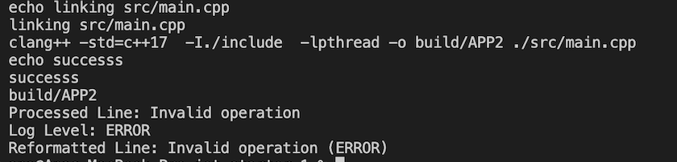
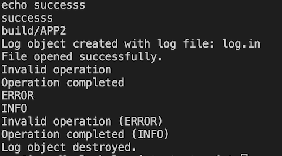
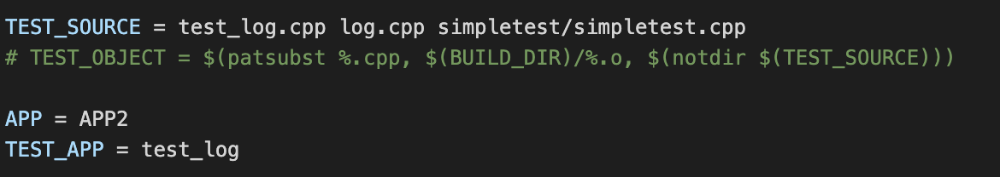
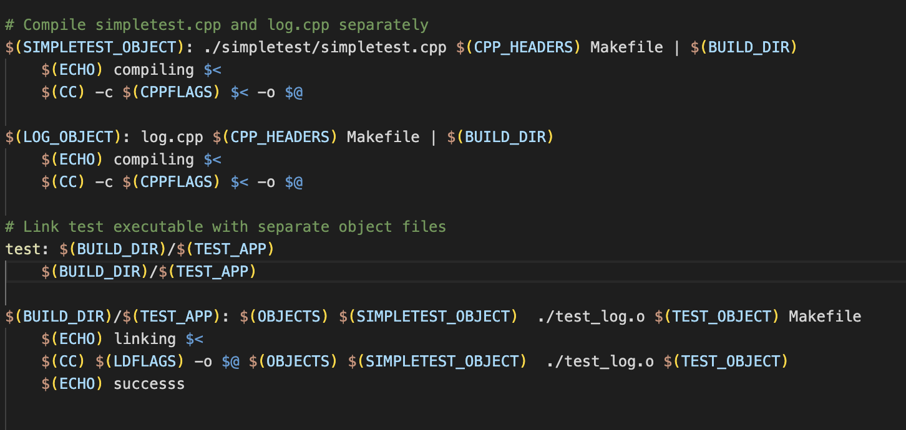
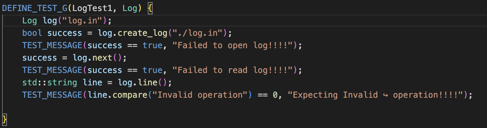
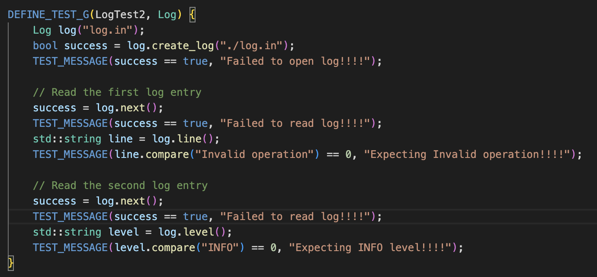
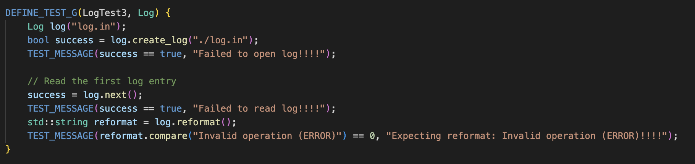
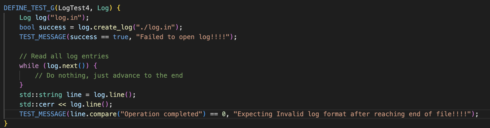
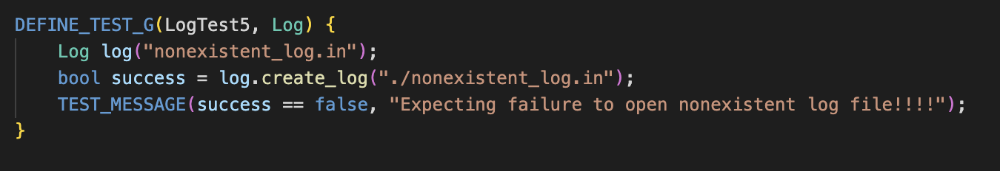
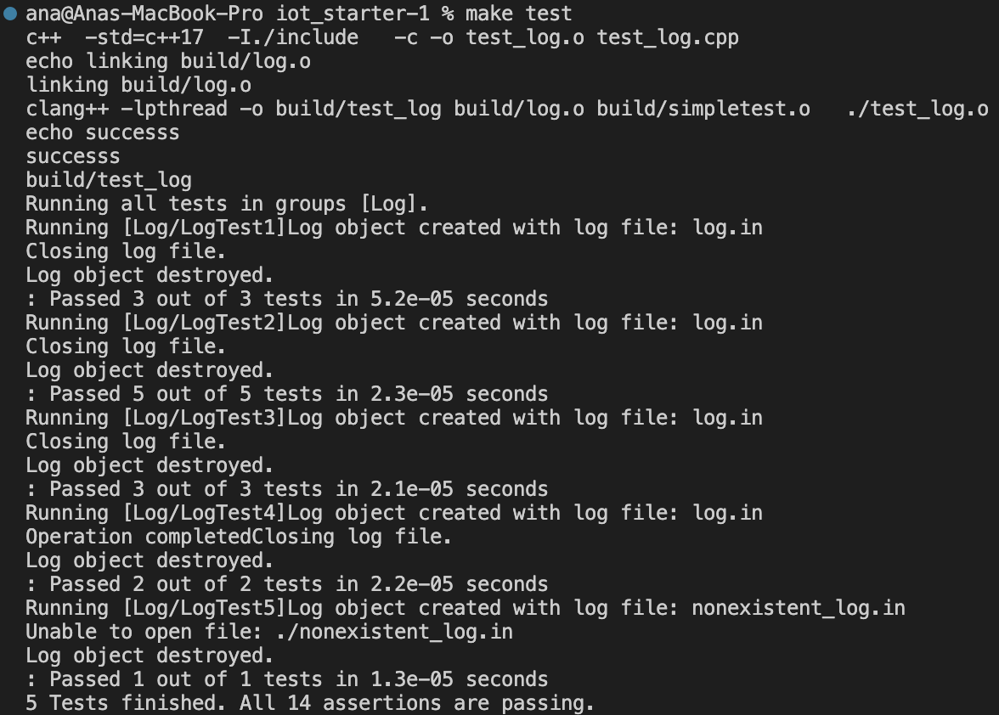

# Echo of C++

_Coding in C++ to read lines, parse from files using `.hpp` and `.cpp`, and perform unit testing._

---

## 📜 Description

This project aims to read content from a file and display it in a variety of ways using C++. It focuses on string parsing (especially structured logs) and demonstrates key principles of object-oriented programming, file handling, and automated testing in C++.

---

## Production - Task 1 
Task 1 is divided in 3 parts. 

**Part 1** - we were required to read from a Line and display the text which would appear after the square brackts. To achieve this i have implemented the following lines of code.

`std::string line(std::string message) {
    size_t endPos = message.find("]:") + 3;

    if (endPos != std::string::npos) {
        std::string logMessage = message.substr(endPos);
        return logMessage;
    } else {
        return "Invalid log format";
    }
}`

In the snippet of code provide, it is aiming to idenntify the square brackts and then display the text after it.

**Part 2** requires to read the content within the square brackets.

`std::string level(std::string message) {
    size_t startPos = message.find("[") + 1;
    size_t endPos = message.find("]");

    if (startPos != std::string::npos && endPos != std::string::npos) {
        std::string logLevel = message.substr(startPos, endPos - startPos);
        return logLevel;
    } else {
        return "Invalid log format";
    }
}`

In this snippet of the code, it is attempting to identify the message within the square brackts and display it.

**Part 3** requires to invert the order in which the text is written and change the [ ] to (). 

`std::string reformat(std::string message) {
    std::string lineLog = line(message);
    std::string levelLog = level(message);

    return lineLog + " (" + levelLog + ")";
}`

In this part of the code it take the results from part one and two and displays in the desired in order as well as changing the [] to (). 

I have writtem part 1, 2 and 3 all in one file so I implemented it as below:

`int main() {
    // Example log message
    std::string logMessage = "[ERROR]: Invalid operation";

    // Process the log message using the 'line' function
    std::string processedLine = line(logMessage);
    std::cout << "Processed Line: " << processedLine << std::endl;

    // Process the log message using the 'level' function
    std::string result = level(logMessage);
    std::cout << "Log Level: " << result << std::endl;

    // Process the log message using the 'reformat' function
    std::string reformattedLine = reformat(logMessage);
    std::cout << "Reformatted Line: " << reformattedLine << std::endl;

    return 0;
}`

## Outcome - Task 1
The code then produces the following output: 

We can see that we have achieved the desired outcome for task 1 as the line displayed after 'Processed line:' is the line after the square brackts. 

Outcome for task 2 is achieved as shown by the output after the line 'Log Level:', it displayed the content from within the square brackets.

And task 3 is achieved by taking the outcome of task 1 and 2 and displaying it in a inverted order and then changing the [] to (), as shown in the "reformatted Line:"

## Task 2
in task 2, my code aims to use a HPP file and a CPP file to execute the methods defined. 

this time the function from task 1 are expanded so that it can read from a file instead. 

The HPP file is where I defined the methods to be called later by the CPP file.

**For my HPP file, I named it "log.hpp" and included the following code:**

`#pragma once
include <iostream> 
ifndef LOG_HPP
define LOG_HPP`

`class Log { 
private:
    std::string filename; // Declare filename as a private member variable
    std::ifstream inputFile;`

`public:
Log(const char* filename);
~Log();
bool create_log(const std::string& filename); 
bool next();
std::string line(std::string message);
std::string level(std::string message);
std::string reformat(std::string message);
};
endif // LOG_HPP`

**For My CPP file, nameed "log.cpp",  i have implemented the functions as it follows:**

`Log::Log(const char* filename) { //simple declaration
    std::cout << "Log object created with log file: " << filename << std::endl;
    
    // Call create_log to open the file and display messages
    if (!create_log(filename)) {
        std::cerr << "Unable to create log file: " << filename << std::endl;
    }
}

bool Log::create_log(const std::string& filename) { //read a file and return true or false.

    // Set the filename member variable
    this->filename = filename;

    // Create an input file stream object
    std::ifstream inputFile(filename);

    // Check if the file is successfully opened
    if (!inputFile.is_open()) {
        std::cerr << "Unable to open file: " << filename << std::endl;
        return false; // Return false if unable to open
    }

    return true; // Return true if the file is successfully opened
}

bool Log::next() {
    // Attempt to read the next line into the filename member variable
    if (std::getline(inputFile, filename)) {
        return true;  // Successfully read the next line
    } else {
        return false; // End of file or error occurred
    }
}

std::string Log::line(std::string message){ //its meant to only read the message after the square brackets.
    size_t endPos = message.find("]:") + 3;

    if (endPos != std::string::npos){
        std::string logMessage = message.substr(endPos);
        return logMessage;
    }
    else {
        // Return an empty string or handle the case where the format is not as expected
        return "Invalid log format";
        }  
}

std::string Log::level(std::string message) {
    // Find the position of the colon after the opening square bracket
    size_t startPos = message.find("[") + 1;
    size_t endPos = message.find("]");

    // Check if the opening and closing square brackets are found
    if (startPos != std::string::npos && endPos != std::string::npos) {
        // Extract the substring between the square brackets
        std::string logLevel = message.substr(startPos, endPos - startPos);
        return logLevel;
    } else {
        // Return an empty string or handle the case where the format is not as expected
        return "Invalid log format";
    }
}

std::string Log::reformat(std::string message) {

    std::string lineLog = line(message);
    std::string levelLog = level (message);

    return lineLog + " (" + levelLog + ")";
}

Log::~Log() { //simple declaration 
    // Destructor logic
    std::ifstream inputFile(filename);
    if (inputFile.is_open()) {
        std::cout << "Closing log file." << std::endl;
        inputFile.close(); // Close the file
    }

    std::cout << "Log object destroyed." << std::endl;

}`

**To call the previously implemented functions, i used the main_part2.cpp file with the following code:**

`
int main()

    //create_long function being called 
    Log myLog("log.in"); // Create an instance of the Log class
    if (myLog.create_log("log.in")) {
        std::cout << "File opened successfully." << std::endl;
        myLog.next();
        // File path
        std::string filename = "log.in";
        // Create an input file stream object
        std::ifstream inputFile(filename);

        //Line 
        std::string fileLine;
        while (std::getline(inputFile, fileLine)) {
            // Process the line using the 'line' function
            std::string processedLine = myLog.line(fileLine);

            // Display the processed message
            std::cout << processedLine << std::endl;
            }
        
        
        // Reset file position to the beginning
        inputFile.clear(); // clear any error flags
        inputFile.seekg(0);

        //Level #######################################
        // Read each line from the file
        while (std::getline(inputFile, fileLine)) {
            std::string result = myLog.level(fileLine);
            std::cout << result << std::endl;
        }   

         // Reset file position to the beginning
        inputFile.clear(); // clear any error flags
        inputFile.seekg(0);

        //Reformat ########################################

        std::string line;
        while (std::getline(inputFile, line)) {
            // Reformat each line and display the result
            std::string reformattedLine = myLog.reformat(line);
            std::cout << reformattedLine << std::endl;
        }

        inputFile.close();
        
    }

    else {
        std::cerr << "Unable to open the file." << std::endl;// Handle the error case
    }
    return 0;`

## Outcome - Task 2
these code in combination provided the following outcome:

## Task 3 - Unit Testing
Task 3 is about testing the code which have been previously developed in task 1 and 2 as well as editing the makefile to make sure that it now has a Test function. 

This is how i edited my makefile:

In this image, i'm defining the Test as a new element. This is so i can call it later when configurating it. 

In this image, i'm configurating the test file so that it runs the correct file and the test desired later on defined in another file. In here i'm also defining 'test' as a form of running the file, this way i can run tests by simpling typing 'make test' when i want to just run the tests. 

## Outcome - Task 3

In the test_log.cpp file I'm runnign 5 different test on my code. 

The **first test** is to test whether my code is able to succesfully open the log file, if the log can move to the next entry and if the content of the current log line is as expected. 

 

The **second test** test the log functionality by creating a log file, reading the first log entry, and then reading the second log entry. Assertions are made at each step to ensure the proper functioning of the logging mechanism, including file creation, log entry reading, and checking specific content and log levels.

The **third test** tests the log functionality by creating a log file, reading the first log entry, and then checking whether the reformatted content of the log entry matches the expected value. The test specifically focuses on the content and format of the log entries, asserting that they meet the expected criteria.

The **Forth test** is designed to ensure that the log system handles the end-of-file condition appropriately and produces the expected log entry content.

The **Fifth test** checks whether the logging system appropriately handles the case where it tries to create a log file that does not exist, and it expects the creation attempt to fail.

with these test being done my code is able to pass all of them as shown below:

